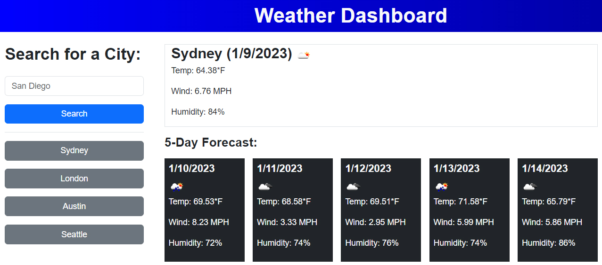

# Weather Dashboard

## Description

A Weather Dashboard that uses the 5 Day Weather API to display the next 5 days of weather for any given city.

## Installation

N/A

## Usage

You can view the site [here.](https://sprocketcreations.github.io/weather-dashboard/) Type in the name of a city and click search. The city will be added to your history, so you can search for it quicker later. The right panel will populate with weather information for the city you submitted.

## Credits

N/A

## License

Check the [license](Licence) in the repo.
